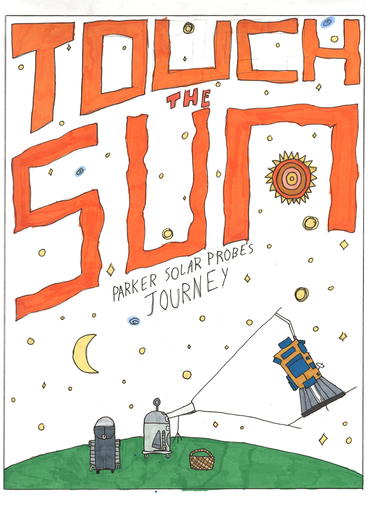
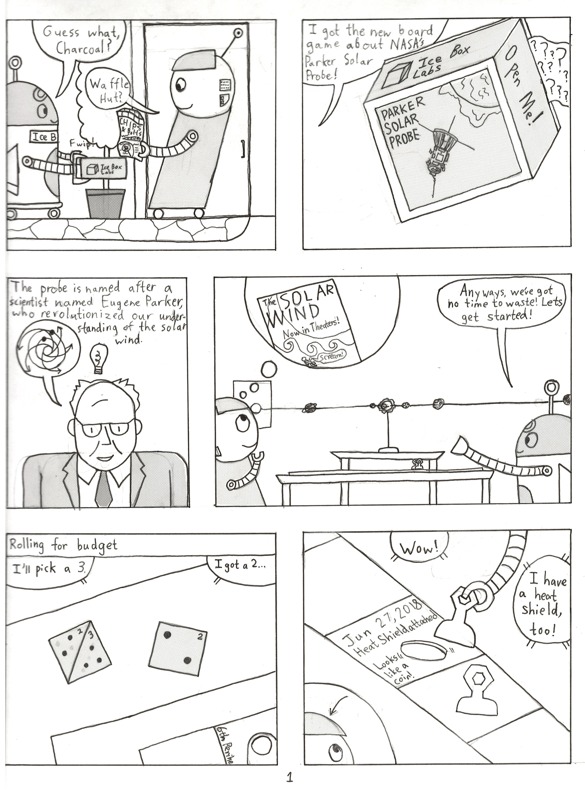
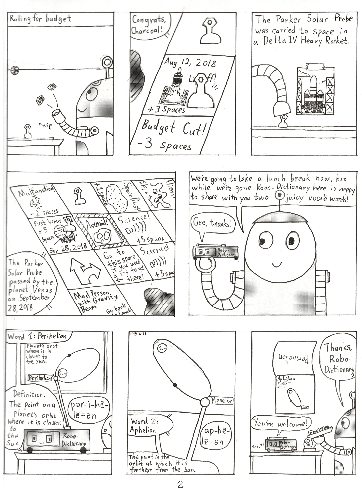
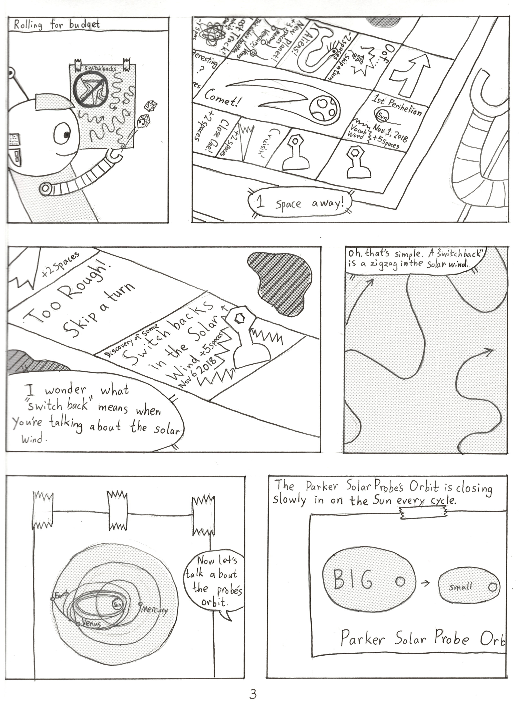
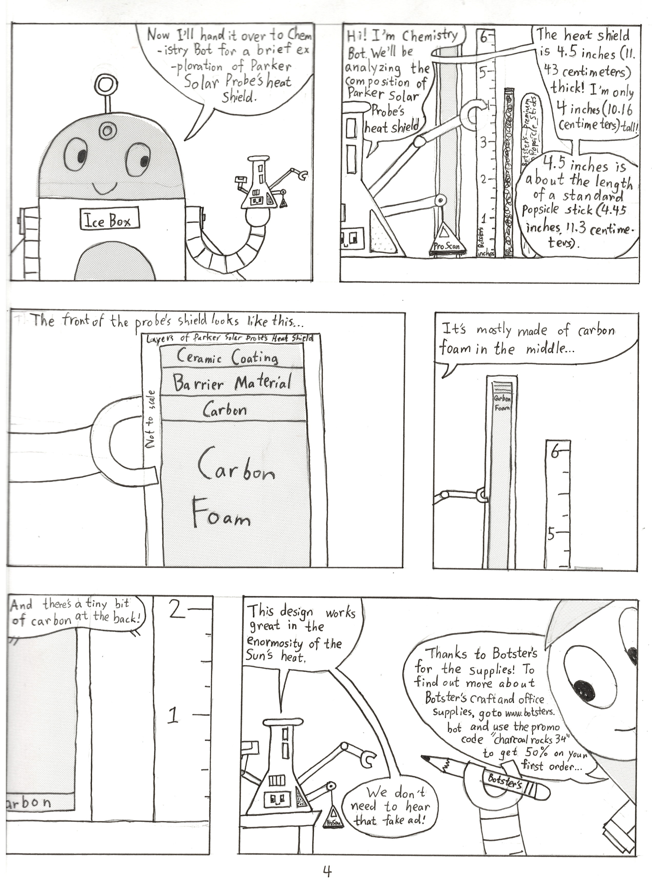
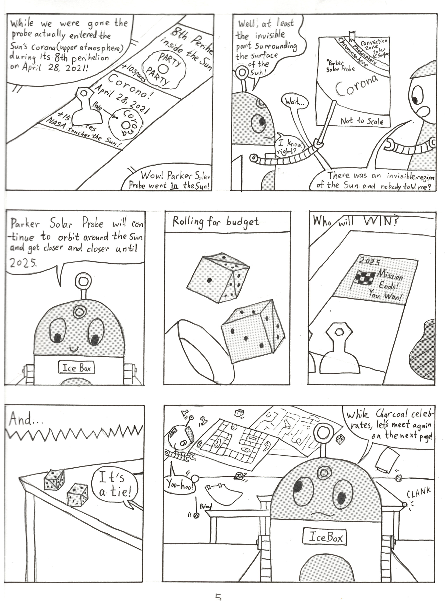
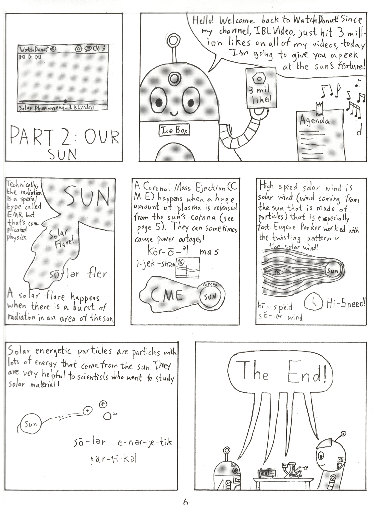

# star-toucher
Touch the Sun: Parker Solar Probe's Journey from Team: Star Toucher for NASA Space Apps 2022

## High-Level Project Summary

We created a hand-drawn comic to tell young audiences the story of Parker Solar Probe’s journey to the sun. Our comic is about two robots, Ice Box and Charcoal, who are playing a board game about Parker Solar Probe. In order to help readers understand the complicated concepts, we’ve included various diagrams in the form of posters in the comic. We also have our experts in language arts and chemistry, Robo-Dictionary and Chemistry Bot to guide us through their fields! A humorous video about the sun acts as the finale of our story. 

Our team also made the board game that main characters were playing in the comic, to help young audiences learn about Parker Solar Probe’s journey in an interactive way.

## Link to Project "Demo"
[Touch the Sun: Parker Solar Probe’s Journey] (https://docs.google.com/presentation/d/1_axSOY6cjkfL0_AHdMrwelSkXeVzkeWY33kyV6vZcL8/edit?usp=sharing)

## Detailed Project Description

### Hand-Drawn Comic: Touch the Sun: Parker Solar Probe’s Journey

In our comic, two robots named Ice Box and Charcoal pick up all sorts of fascinating facts about Parker Solar Probe along with resident specialists Robo-Dictionary and Chemistry Bot, through a board game by Ice Box Labs. Charcoal is a city robot who has some silly ideas about astronomy, while Ice Box, who has lots of experience with high temperatures from fighting Global Warmer, Ice Box’s nemesis, has a whole bot-load of facts. The story ends with a clip from WatchDonut, a popular video sharing platform for robots, about our closest star, the sun.

Note: This description always uses the robots’ full names since robots don’t have pronouns.

  

Comic Cover

  

Page 1 (Reading order: left to right, top to bottom, same below)

1. Two robots Ice Box and Charcoal met in the yard.
Ice Box: “Guess what, Charcoal?”
Charcoal: “Waffle Hut?”

2. Ice Box: “I got the new board game about NASA’s Parker Solar Probe!”

3. Ice Box (continued): “The probe is named after a scientist named Eugene Parker, who revolutionized our understanding of the solar wind.”

4. Charcoal was thinking about the new movie in the theater called “The Solar Wind”.
Ice Box: “Anyways, we’ve got no time to waste! Let's get started!”

5. They started rolling the dice which is called “rolling for budget” in this board game.
“I’ll pick a 3.”
“I got a 2…”

6. Charcoal moved his “pawn” to the game board square: “June 27, 2018 Heat Shield attached.
Looks like a coin!”
Charcoal: “I have a heat shield tool!”

  

Page 2

1. Continued “rolling for budget”

2. The square said “Aug 12, 2018, lift! +3 spaces”
Ice Box: “Congrats, Charcoat!”

3. The Parker Solar Probe was carried to space in a Delta IV heavy rocket.

4. Game pawn moved to the square “Sep 28, 2018, First Venus Flyby. +5 spaces”
“The Parker Solar Probe passed by the planet Venus on September 28, 2018”.

5. Charcoal: “We’re going to take a lunch break now, but while we’re gone Robo-Dictionary here is happy to share with you two juicy vocab words!”

6. The tiny Robo-Dictionary was explaining: “Word 1: Perihelion. Definition: The point on a planet’s orbit where it is closest to the sun.”

7. Robo-Dictionary continued: “Word 2: Aphelion. The point in the orbit at which it is furthest from the sun.”

8. Ice Box and Charcoal came back with their “robot lunch”. 
Ice Box: “Thanks, Robo-Dictionary.”
Robo-Dictionary: “You’re welcome!”

  

Page 3

1. Charcoal continued to roll the dice.

2. Their game pawns were very close, only one space away!
A game board square said: “1st Perihelion, Nov 1, 2018. +5 spaces”

3. Moved to the game square “2019, Discovery of some switchbacks in the Solar Wind. + 5 spaces”
“I wonder what ‘switchback’ means when you’re talking about the Solar Wind.”

4. “On, that’s simple. A ‘switchback’ is a zigzag in the Solar Wind.”

5. “Now let’s talk about the probe’s orbit.”

6. The Parker Solar Probe’s orbit is closing slowly in on the sun every cycle.

  

Page 4

1. Ice Box: “Now I’ll hand it over to Chemistry Bot for a brief exploration of Parker Solar Probe’s heat shield.”

2. Chemistry Bot: “Hi! I’m Chemistry Bot. We’ll be analyzing the composition of Parker Solar Proble’s heat shield.” 
“The heat shield is 4.5 inches (11.43 centimeters thick! I’m only 4 inches (10.16 centimeters) tall! “4.5 inches is about the length of a standard popsicle stick (4.45 inches, 11.3 centimeters)”

3. Chemistry Bot held a diagram of the heat shield and continued: “The front of the probe’s shield looks like this…”
Layer of Parker Solar Probe’s head shield (Not to scale): Ceramic Coating, Barrier Material, Carbon, Carbon Foam

4. “It’s mostly made of carbon foam in the middle…”

5. “And there’s a tiny bit of carbon at the back!”

6. Chemistry Bot: “This design works great in the enormous of the sun’s heat”.
Charcoal was holding a pencil with the brand “Botster’s”: “Thanks to Botster’s for the supplies! To find out more about Botster’s craft and office supplies, go to ‘www.botsters.bot’ and use the promo code ‘charcoalrocks34’ to get 50% on your first order… ”
Chemistry Bot: “We don’t need to hear that fake Ad!”

  

Page 5

1. “While we were gone the probe actually entered the sun’s corona (upper atmosphere) during its 8th perihelion on April 28, 2021!”
Two game board squares: “8th Perihelion inside the sun. +10 spaces” and “Corona! April 28, 2021. NASA touches the sun! +15 spaces”
Charcoal: “Wow, Parker Solar Probe went in the sun!”

2. Ice Box: “Well, at least the invisible part surrounding the surface of the sun!”
Charcoal: “Wait…”
Ice Box: “I know, right?”
Charcoal: “There was an invisible region of the sun and nobody told me?”

3. Ice Box: “Parker Solar Probe will continue to orbit around the sun and get closer and closer until 2025.”

4. Rolling for budget

5. Who will WIN?
They were near the end of the board game “2025 Mission Ends! You won!”

6. And…
“It’s a tie!”

7. Charcoal: ”Yoo-hoo!”
Boing! CLANK!
Ice Box: “While Charcoal celebrates, let’s meet again on the next page!”

  

Page 6

1. Part 2: Our sun
Solar Phenomena-IBLVideo playing on WatchDonut+ streaming platform

Note: IBL stands for Ice Box Labs

2. Ice Box: Hello! Welcome back to WatchDonut! Since my channel, IBLVideo, just hit 3 million likes on all of my videos, today I’m going to give you a peek at the sun’s feature!

3. Technically, the radiation is a special type called EMR, but that’s complicated physics.
A solar flare happens when there is a burst of radiation in an area of the sun.

4. A Coronal Mass Ejection (CME) happens when a huge amount of plasma is released from the sun’s corona (see page 5). They can sometimes cause power outages!

5. High speed solar wind is solar wind (wind coming from the sun that is made of particles) that is especially fast. Eugene Parker worked with the twisting pattern in the solar wind!

6. Solar energetic particles are particles with lots of energy that come from the sun. They are very helpful to scientists who want to study solar material!

7. Ice Box, Charcoal, Robo-Dictionary and Chemistry Bot (all together): “The End!”

### Hand-crafted Board Game:

Our team actually made the board game that my characters are playing in my comic. Most of the tiles, like “Aliens!”, “Malfunction”, and “Cruisin’” actually feature in the comic! For people who don’t know the rules, there’s an instructions section with all of the details about our game.

  

## SPACE AGENCY DATA
We used space agency data to enrich the knowledge and facts in our comic and board game. The main data and information we used are:

Parker Solar Probe
https://www.nasa.gov/content/goddard/parker-solar-probe

Parker Solar Probe - NASA Solar System Exploration
https://solarsystem.nasa.gov/missions/parker-solar-probe/in-depth/

We obtained detailed information about the Parker Solar Probe from NASA’s website, for example we learned that the probe was named after Eugene Parker. It’s the first NASA mission named for a living researcher, and it’s humanity’s first mission to explore the sun up close. 

We drew a portrait for Professor Eugene Parker in our comic and include all this fascinating information.

Delta IV Parker Solar Probe Mission Booklet
https://www.ulalaunch.com/docs/default-source/launch-booklets/divh_parkersolarprobe_mob.pdf

We learned about the Delta IV heavy rocket, which carried Parker Solar Probe to space. We included the rocket and launch information into our comic and board game.

The Mission - Parker Solar Probe
http://parkersolarprobe.jhuapl.edu/The-Mission/index.php

We obtained Parker probe’s orbit information from JHU Applied Physics Laboratory Parker Solar Probe project site, and explained them in our comic and board game.

Parker Solar Probe Heat Shield
https://www.nasa.gov/feature/goddard/2018/traveling-to-the-sun-why-won-t-parker-solar-probe-melt
https://www.nasa.gov/feature/goddard/2018/cutting-edge-heat-shield-installed-on-nasa-s-parker-solar-probe
https://hub.jhu.edu/2018/08/06/parker-solar-probe-heat-shield-explained/

We explained the material and design of Parker’s head shield, and how it protected the probe from the sun. We learned these fantastic facts from NASA’s space agency sites.

Layers of the Sun
https://www.nasa.gov/mission_pages/iris/multimedia/layerzoo.html

As the finale of our comic, we depicted a humorous video about the sun. We learned this knowledge and data from NASA’s sites.

## HACKATHON JOURNEY
It was a very fun and educational journey for our Space Apps hackathon project. We made a comic about the Parker Solar Probe and its journey to the sun, and a board game that is playable. We learned a lot about not only the Parker probe (for example it’s the fastest human-made object and first human-made object to enter the sun’s atmosphere), but also the scientist who the probe was named after, as well as our sun. 

We hope more people, especially young audiences, would know about the Parker Solar Probe by reading our comic and playing the board game.

## REFERENCES
Tools we used in our project:

Hands, paper, cardboard, pencils, pens and screen tone. Zero carbon emissions from our Space Apps project!

Data and Resources: 
https://www.nasa.gov/content/goddard/parker-solar-probe

https://www.nasa.gov/content/parker-solar-probe-media-resources

https://www.nasa.gov/sites/default/files/atoms/files/parkersolarprobe_presskit_august2018_final.pdf

https://solarsystem.nasa.gov/missions/parker-solar-probe/in-depth/

https://www.nasa.gov/feature/goddard/2021/nasa-enters-the-solar-atmosphere-for-the-first-time-bringing-new-discoveries

https://www.space.com/37044-nasa-parker-solar-probe-mission-infographic.html

https://www.ulalaunch.com/docs/default-source/launch-booklets/divh_parkersolarprobe_mob.pdf

https://www.nasa.gov/feature/goddard/2018/traveling-to-the-sun-why-won-t-parker-solar-probe-melt

https://www.nasa.gov/feature/goddard/2018/cutting-edge-heat-shield-installed-on-nasa-s-parker-solar-probe

https://hub.jhu.edu/2018/08/06/parker-solar-probe-heat-shield-explained/

https://www.nasa.gov/mission_pages/iris/multimedia/layerzoo.html

## TAGS
#art #comic #boardgame #sun #parker
